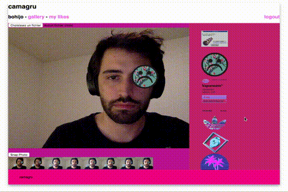

[PROJECT 42 SCHOOL]
=========

Install
-------
open config/database.php and configure the next variables : 
`$DB_NAME = 'camagru';` 
`$DB_USER =  'root';` 
`$DB_PASSWORD = 'root';` 

then go to `/config/setup.php` to install the database.

Techno
---------
PHP with gd library 
JavaScript (no jQuery) / JSON / xhr

Todo
------
upload png collection
